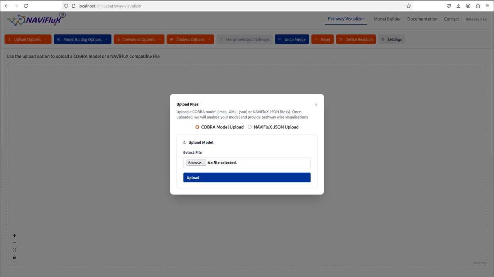
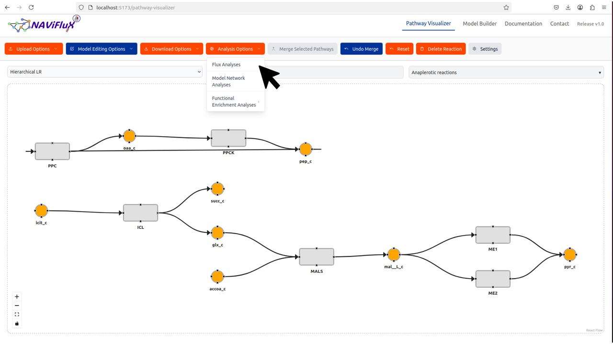
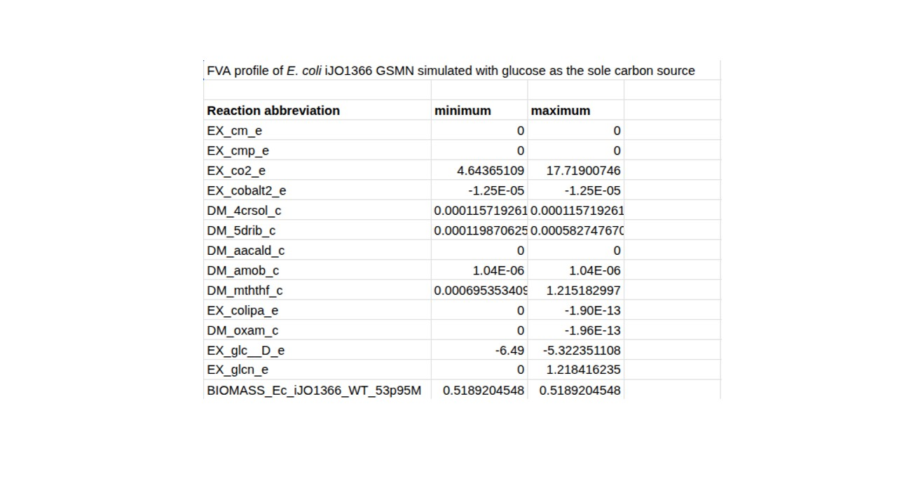
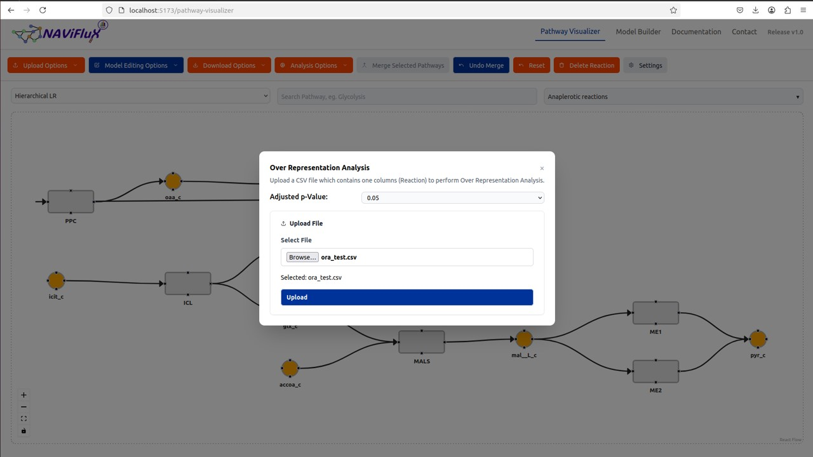
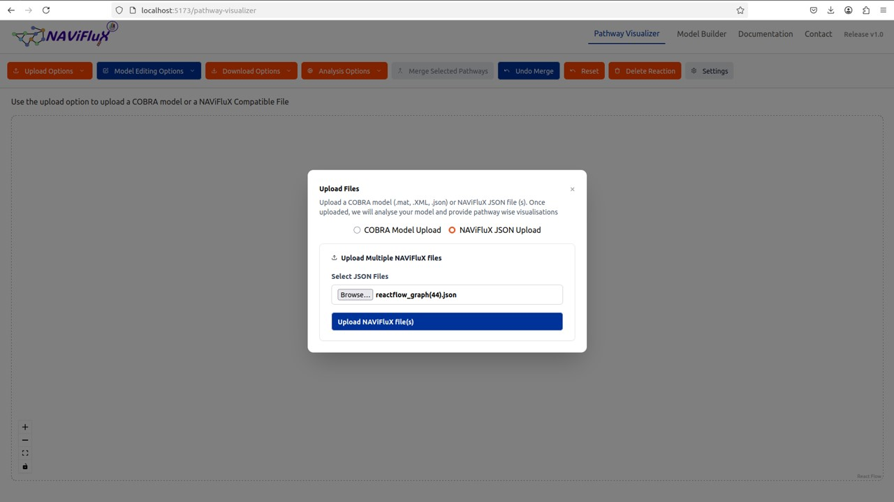
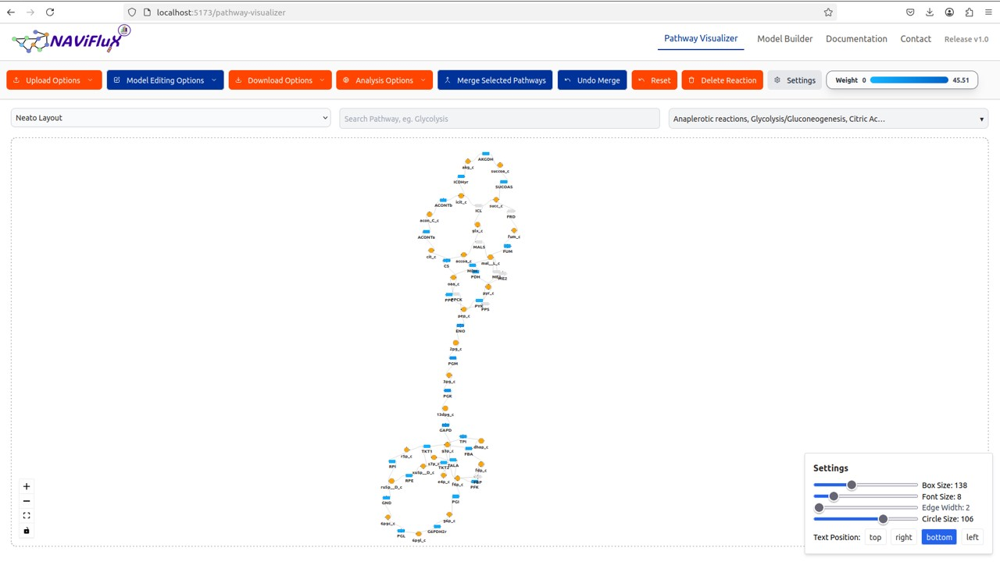

---
hide:
  toc: true             # hides the right sidebar
---

### Condition-specific flux analyses and visualizations for the comparison of carbon source utilization by Escherichia coli 

Step 1: Model selection

The genome-scale metabolic model [*iJO1366*](http://bigg.ucsd.edu/static/models/iJO1366.mat) of *E. coli* was selected for this study.
The model in .mat format was downloaded from the [BiGG](http://bigg.ucsd.edu/) database and uploaded through Upload Options in NAViFluX.

{ width="800" }

Step 2: Environmental condition selection

From a [published targeted metabolomics study](https://www.sciencedirect.com/science/article/pii/S258900422200774X), 11 growth conditions corresponding to distinct carbon sources were chosen.
Each condition consisted of M9 minimal medium supplemented with a single carbon source. Flux Analyses option from Analysis Options module in NAViFluX was choosen to simulate each carbon condition.

{ width="800" }

The input exchange lower bound for each of the carbon source was calculated through Metabotools function implemented in CobraToolbox. The exchange lower bound for each Carbon source was set each time and other Carbon source lower bound were set to zero before simulating Flux Variability Analysis (FVA).

{ width="800" }

Step 3: Simulating FVA

After setting the exchange lower bound, in the next window "BIOMASS_Ec_iJO1366_WT_53p95M" reaction was selected as Cellular objective and FVA option was choosen and then Calculate and download results. This step was repeated each time for all the 11 Carbon source conditions.

{ width="800" }

Step 4: Determining the active reactions through FVA results for each Carbon source condition.

FVA results consisted of Min and Max flux for each reaction at each condition. The active reactions are those reactions whose sum of Min and Max flux is not equal to zero, suggesting the reaction is active at that particular condition.

{ width="800" }

All the metabolites of the active reactions at each condition was extracted and matched with the original study to check the consistency of FVA. FVA was able to detect all the metabolites reported in the targeted metabolomics study along with additional set of metabolites.

Step 5: Over-representation analysis (ORA)

The active reactions at each condition were also used to perform Over-representation analysis through NAViFluX.
Functional Enrichment Analyses option consists Over-Representation Analysis which requires a CSV file which contains the list of the reacions. 

{ width="800" }

The active set of reactions at each condition was used to perform the analysis 11 times and the results were downloaded.

{ width="800" }

Step 6: Clustering of the enriched pathways across conditions.

ORA results of each condition were used to plot a heatmap to determine overlapping pathways and unique pathways. Heatmap cleraly showed the clustering of the 11 Carbon source condition into 3 distinct clusters. ORA results will look like below.

{ width="800" }

Step 7: Selection of pathways.

Pathways common across clusters and unique pathways for specific conditions were determined. Flux distribution of Group 1 and Group 2 were choosen for visualization.
For visualization, "Glycolysis/Gluconeogenesis", "Citric Acid Cycle", "Pentose Phosphate Pathway" and "Anaplerotic Reactions" pathways selected and merged using 'Merge Selected Pathways' option in NaviFlux. 

{ width="800" }

The merged pathway was choosen and NAViFluX File was downloaded through Download Options in NAViFluX for further use.

{ width="800" }

Step 8: Visualization and downloading the results.

The downloaded 'merged' NAViFluX JSON was uploaded through JSON Upload option in NAViFluX.

{ width="800" }

FVA results for each condition was prepared as weight file by taking the average of Min and Max fluxes. For representative visualisation of Group 1 and Group 2 Glucose and Acetate results were used. Hence prepared Weight files were uploaded to NAViFluX as 'Flux Weight File'. 

{ width="800" }

The reactions were rearranged and specific layout options were choosen through interactive GUI of the NAViFlux. 
Reactions which do not carry any flux in these merged pathways were deleted through 'Delete Reaction' option. The font size, edge width and Node size were adjusted through 'Settings' option in NaviFlux.

{ width="800" }

After proper rearrangement NAViFluX JSON and image in PDF, SVG and PNG format were downloaded

{ width="800" }

