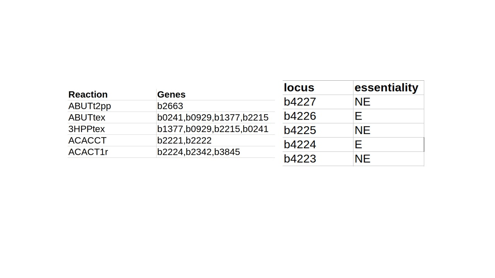
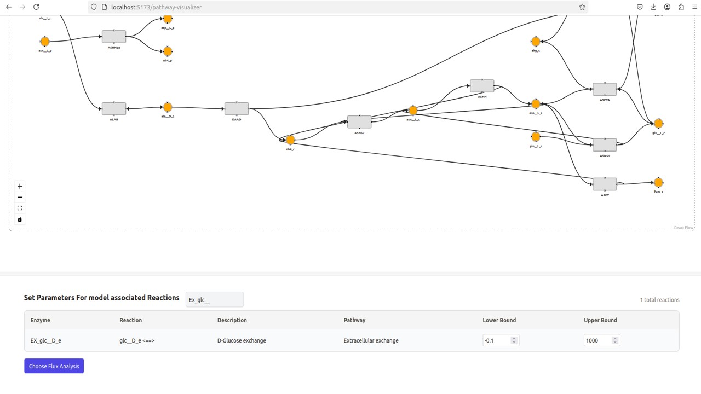
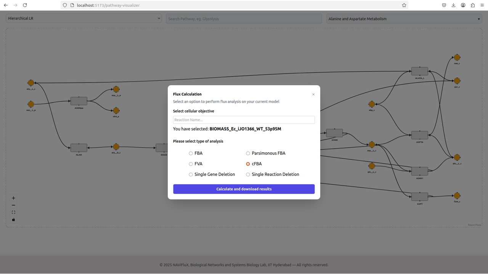
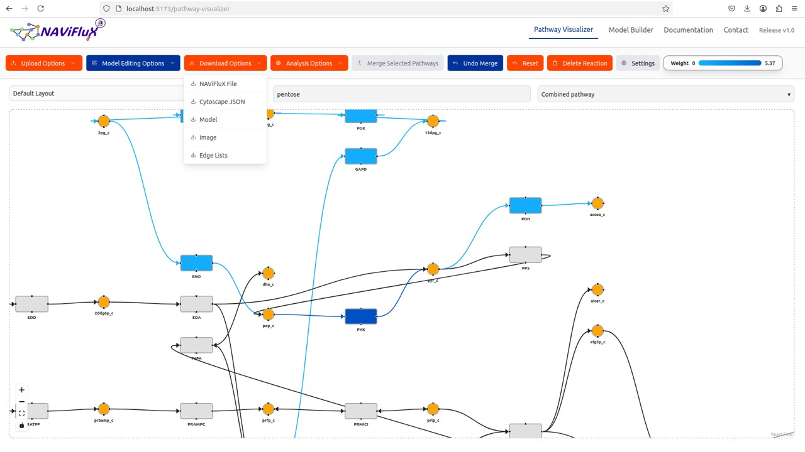
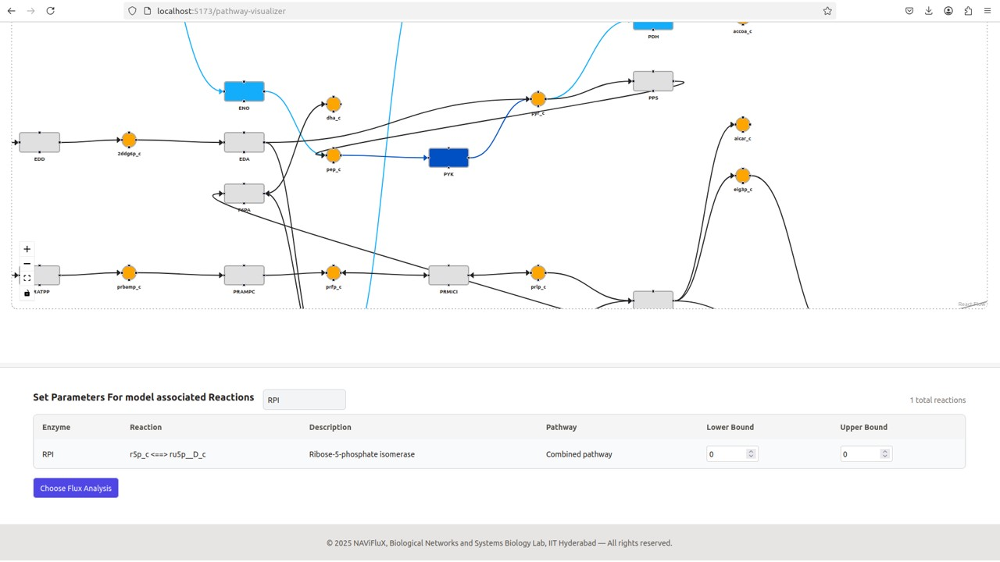
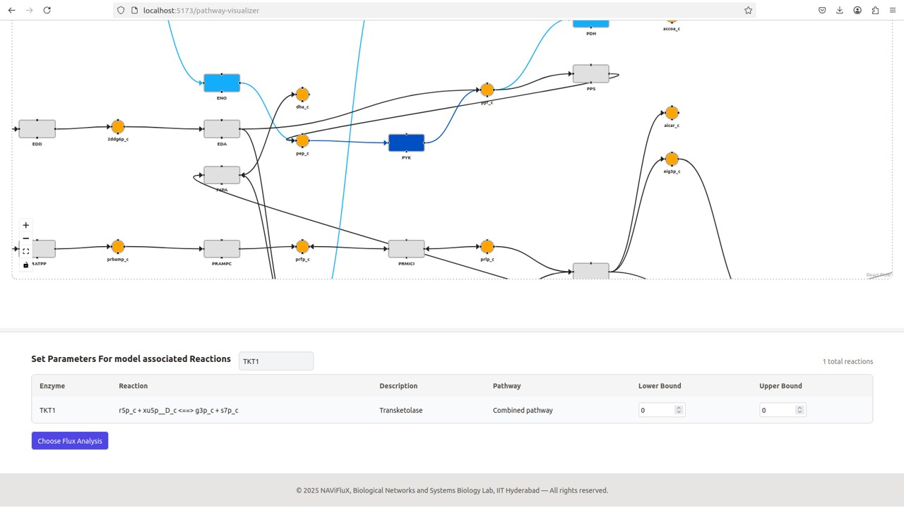

---
hide:
  toc: true             # hides the right sidebar
---

### Improving essential gene predictions in *E. coli* using intuitive single-gene deletion simulations

Step 1: Model selection

The genome-scale metabolic model [*iJO1366*](http://bigg.ucsd.edu/static/models/iJO1366.mat) of *E. coli* was selected for this study.
The model in .mat format was downloaded from the [BiGG](http://bigg.ucsd.edu/) database and uploaded through Upload Options in NAViFluX.

{ width="800" }

Step 2: Mapping gene essentiality to reactions

Genes from the [KEIO library](https://pmc.ncbi.nlm.nih.gov/articles/PMC1681482/) were mapped to their corresponding reactions in the iJO1366 model using gene-reaction associations.
Reactions associated with essential and non-essential genes were separated for comparative analysis.

{ width="800" }

Step 3: Setting up the metabolic environment

The iJO1366 model was constrained to simulate growth in MOPS minimal medium.
Environmental constraints were applied using the same procedure described in Case Study 1.

{ width="800" }

Step 4: Cycle-free Flux Balance Analysis (cFBA)

Cycle-free flux balance analysis (cFBA) was performed using the Flux Analysis module in NAViFluX.

{ width="800" }

Flux magnitudes of reactions associated with essential and non-essential genes were compared.
Non-essential reactions exhibited larger flux magnitudes, whereas essential reactions carried lower but indispensable fluxes.

Step 5: Single-gene deletion simulation and model evaluation

Single-gene knockout simulations were performed in NAViFluX, available in "Flux Analyses" module.
Predicted growth rates were compared against KEIO essentiality annotations.

{ width="800" }

Step 6: Investigating incorrect predictions (PRPPS case)
Phosphoribosyl pyrophosphate synthetase (PRPPS) is experimentally essential for biomass synthesis.
However, the default iJO1366 model predicted PRPPS to be non-essential. Exploration in NAViFluX revealed an alternative prpp synthesis route via Ribose-1,5-bisphosphokinase (R15BPK).
The R15BPK reaction was constrained to 0 mmol/(gDW·hr) to eliminate the alternative prpp synthesis route. This forced biomass production to depend on PRPPS.

{ width="800" }

Similarly, glucose uptake via GLCptspp was partially constrained to maintain activity of HEX1, preserving realistic glucose catabolism.

{ width="800" }

After applying minimal internal constraint revisions, gene essentiality predictions were recomputed.
The model performance improved slightly to an auROC of 0.76. 

Step 7: Constructing the prpp synthesis sub network.

To mechanistically study prpp synthesis, three subsystems were merged: Glycolysis, Pentose phosphate pathway, Histidine metabolism

{ width="800" }

The resulting merged sub network represented net glucose catabolism towards prpp synthesis.
Cycle-free FBA was performed in the wild-type model using NAViFluX "Flux Analyses" module.
Flux overlay showed that RPI-mediated oxidative PPP was the preferred route for prpp synthesis. This visualization was stored in NAViFluX’s native JSON format.

{ width="800" }

Step 8: Single knockout of RPI

The RPI reaction was knocked out by fixing its flux bounds to zero.

{ width="800" }

Following the knockout, prpp synthesis was rerouted entirely through the non-oxidative PPP, driven by TKT1 activity.

Step 9: Double knockout of RPI and TKT1

A double knockout was simulated by constraining both RPI and TKT1 reactions to zero.
This eliminated both oxidative and non-oxidative PPP routes.

{ width="800" }

The double knockout confirmed that RPI and TKT1 form a synthetic essential pair for prpp-dependent biomass synthesis.

