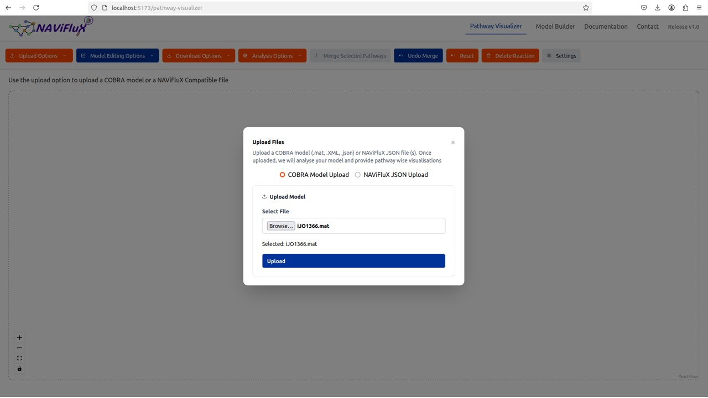
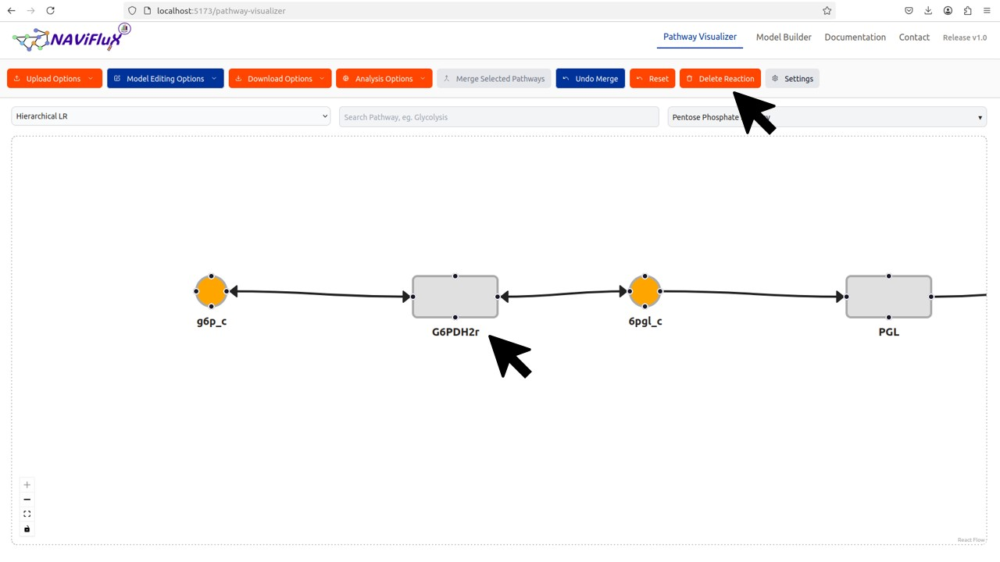
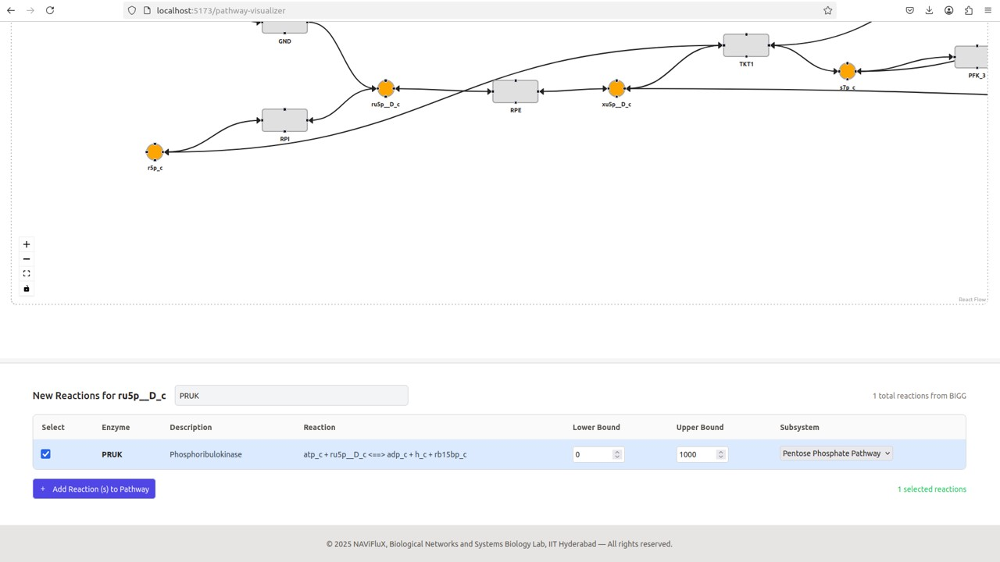
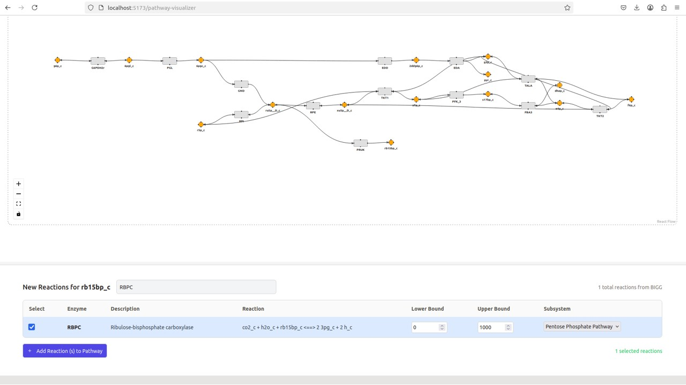
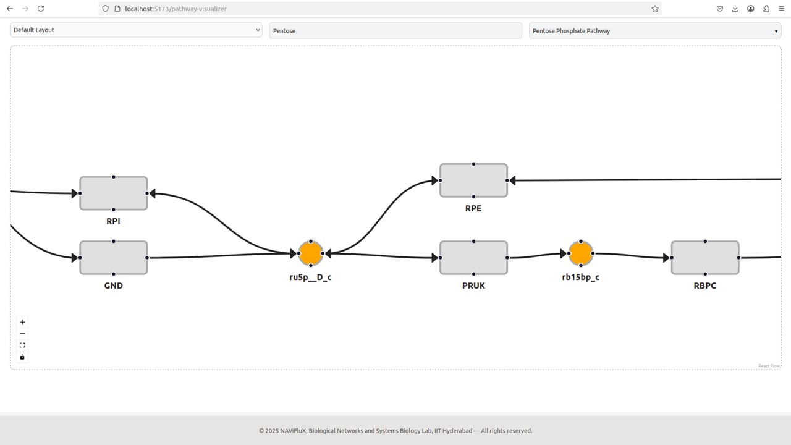
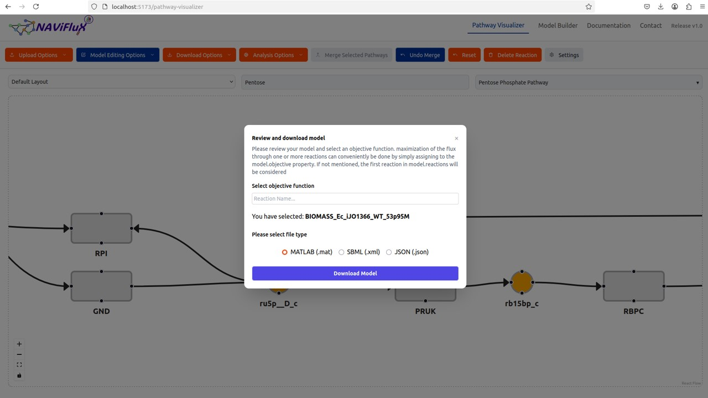
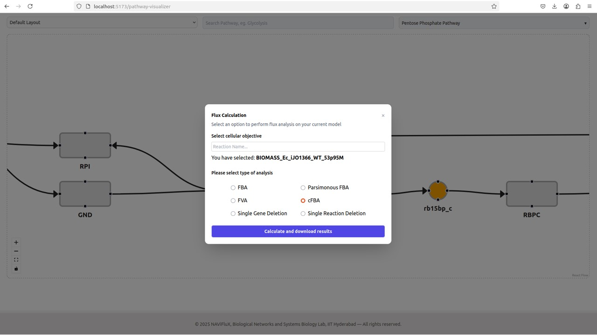
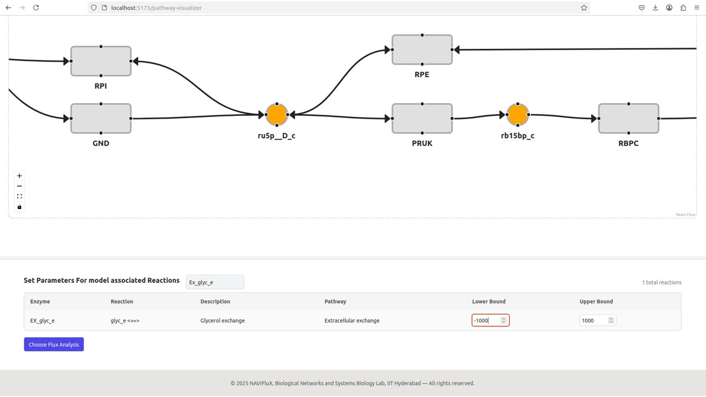

---
hide:
  toc: true             # hides the right sidebar
---

### Engineering an *E. coli* metabolic network for carbon fixation

Step 1: Model selection

The genome-scale metabolic model [*iJO1366*](http://bigg.ucsd.edu/static/models/iJO1366.mat) of *E. coli* was selected for this study.
The model in .mat format was downloaded from the [BiGG](http://bigg.ucsd.edu/) database and uploaded through Upload Options in NAViFluX.
Growth conditions were defined using M9 minimal medium, consistent with the original study.
Environmental uptake constraints were applied using NAViFluX, following the procedure in Case Study 1.

{ width="800" }

Step 2: Constructing the engineered mutant model
A “mutant” metabolic network was created by simulating gene deletions and enzyme insertions using NAViFluX.
Following reactions were deleted from the model, using "Delete Reaction" option in NAViFluX.

Phosphoglycerate mutase (PGM), Glucose-6-phosphate dehydrogenase (G6PDH2r),Phosphofructokinase (PFK),Glyoxylate shunt reactions (ICL, MALS, ICDHx)

{ width="800" }

{ width="800" }

{ width="800" }

Step 3: Addition of Calvin–Benson–Bassham (CBB) cycle enzymes

The CBB cycle enzymes RuBisCO (RBPC) and phosphoribulokinase (PRUK) were added to the model using "Select Metabolite for New Reaction option".
For adding PRUK reaction "ru5p__D_c" metabolite form Pentose Phosphate Pathaway was clicked, and to add RBPC "rb15bp_c" metabolite was clicked.

{ width="800" }

{ width="800" }

{ width="800" }

{ width="800" }

{ width="800" }

Step 4: The updated model was downloaded with "Download Options" in .mat format and used for further analyses.

{ width="800" }

Step 5: Defining pyruvate uptake constraints.

The updated model was uploaded again to the NAVIFluX and Pyruvate uptake (Lower bound of "Ex_Pyr_e"") was constrained to 16 mmol/(gDW·hr), as reported experimentally.

{ width="800" }

Step 6: Cycle-free flux balance analysis

After defining the Pyruvate uptake Cycle Free Flux (cFBA) was choosen, with "BIOMASS_Ec_iJO1366_WT_53p95M" as Cellular objective.

{ width="800" }

A growth rate of 23 mmol/(gDW·hr) was predicted, consistent with published experimental and modeling studies.

Step 7: Optimizing pyruvate uptake

Pyruvate uptake was systematically reduced to study its impact on acetate and CO₂ release. Each time "Ex_pyr_c" lower bound was set to -16.7, -13.36, -10.02, -6.68, -3.34 and 0.
cFBA was performed each time, flux profiles were downloaded. The reaction fluxes of "BIOMASS_Ec_iJO1366_WT_53p95M", "Ex_ac_e", "Ex_Co2_e" fluxes were noted each time. 

{ width="800" }

Step 8: Exploring alternative carbon sources.

After determining that "Ex_ac_e" was 0 when "Ex_pyr_e" was -3.34, alternative Carbon sources were also tested. For instance Ex_Glyc_e lower bound was set to -1000, with Ex_pyr_e at 0,
It's observed that Ex_Glyc_e flux was -6.51, and "BIOMASS_Ec_iJO1366_WT_53p95M", Ex_ac_e, Ex_co2_e were noted down.

{ width="800" }

Similarly Ex_xyl__D_e lower bound also set to -1000, and the corresponding reaction fluxes were noted down.

{ width="800" }

Step 9: Finalising the Carbon uptake.

After multiple comparisons, Ex_pyr_e at lower bound -4 and Ex_Glyc_e at lower bound -7, was finalised at which "BIOMASS_Ec_iJO1366_WT_53p95M" is maximum and Ex_Co2_e and Ex_ac_e were minimum.

