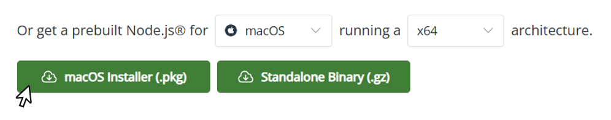
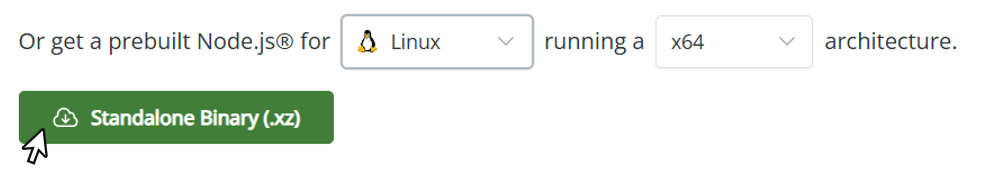

---
hide:
  navigation: true      # hides the left sidebar
---

# **Installation Guide**

In order to run the application on your system, it is essential to have these prerequisites installed on your computer. Please follow the steps below to set up the dependencies based on your current operating system.

!!! tip "Video Tutorial"
    A step-by-step video tutorial for the installation procedure is available on our YouTube channel: [**BNSB Lab - IITH**](https://www.youtube.com/@BNSBLab-IITH)

---

## NodeJS Installation

### **Step 1: Download Node.js**

Go to the official **Node.js download page** and download the installer for your operating system:
[https://nodejs.org/](https://nodejs.org/)

* **Windows**
  

* **MacOS**
  

* **Linux**
  

---

### **Step 2: Install Node.js**

Run the downloaded installer and follow the on-screen instructions:

* Accept the license agreement
* Choose the installation directory (default is recommended)
* Ensure **“Add to PATH”** is checked
* Complete the installation

---

### **Step 3: Verify Installation**

Open a terminal or command prompt and run:

```bash
node --version
```

```bash
npm --version
```

If both commands return version numbers, Node.js and npm have been installed successfully.


---

## Python Installation (Python 3.12)


### **Step 1: Download Python**

Go to the official Python website and download **Python 3.12** for your operating system:

[https://www.python.org/downloads/](https://www.python.org/downloads/)

* **Windows**
  Download the **Windows installer (64-bit)**.

* **MacOS**
  Download the **macOS universal installer**.

* **Linux**
  Use your system package manager **or** build from source (recommended for Python 3.12).

---

### **Step 2: Install Python**

#### **Windows**

* Run the downloaded `.exe` file
* **Check “Add Python to PATH”** (very important)
* Click **Install Now**
* Complete the installation

#### **MacOS**

* Open the downloaded `.pkg` file
* Follow the installation wizard
* Python will be installed under `/usr/local/bin/python3`

#### **Linux (Ubuntu / Debian example)**

```bash
sudo apt update
sudo apt install python3.12 python3.12-venv python3.12-dev
```

> If Python 3.12 is not available via apt, install it from source:

```bash
sudo apt install build-essential libssl-dev zlib1g-dev \
libncurses5-dev libncursesw5-dev libreadline-dev libsqlite3-dev \
libgdbm-dev libbz2-dev liblzma-dev tk-dev wget

wget https://www.python.org/ftp/python/3.12.0/Python-3.12.0.tgz
tar -xf Python-3.12.0.tgz
cd Python-3.12.0
./configure --enable-optimizations
make -j$(nproc)
sudo make altinstall
```

---

### **Step 3: Verify Installation**

Open a terminal or command prompt and run:

```bash
python --version
```

or

```bash
python3 --version
```

You should see output similar to:

```text
Python 3.12.x
```

---

### **Step 4: Verify pip (Python Package Manager)**

```bash
pip --version
```

or

```bash
pip3 --version
```

---

## Download and Run NAViFluX

### **Step 1: Get the Source Code**

You can obtain the software in either of the following ways:

* **Option 1:** Clone the repository

  ```bash
  git clone "https://github.com/bnsb-lab-iith/NAViFluX"
  ```

* **Option 2:** Download the repository as a ZIP file and extract it

---

### **Step 2: Install Dependencies and Run**

Follow the instructions based on your operating system:

* **Windows**

  ```powershell
  .\install.ps1
  .\run.ps1
  ```

* **Linux**

  ```bash
  
  ./install.sh
  ./run.sh
  ```

* **MacOS**

  ```bash
  
  ./install.sh
  ./run_mac.sh
  ```

---


## If the Scripts Don’t Work (Manual Setup)

No worries — you can still run the application manually by following the steps below.

---

### **Step 1: Start the Frontend**

**1.** Open a terminal and navigate to the **client** folder:

```bash
cd client
```

**2.** Install the required Node.js dependencies:

```bash
npm install
```

**3.** Start the development server:

```bash
npm run dev
```
**4.** Open the link on your browser

---

### **Step 2: Start the Backend**

**1.** Open a **new terminal** window and navigate to the backend directory.

**2.** Create a Python virtual environment:

```bash
python -m venv .venv
```

**3.** Activate the virtual environment based on your OS:

* **Windows**

  ```powershell
  .venv\Scripts\activate
  ```

* **MacOS / Linux**

  ```bash
  source .venv/bin/activate
  ```

**4.** Install Python dependencies:

```bash
pip install -r requirements.txt
```

**5.** Run the Flask server:

```bash
flask run
```

---

## Performance Benchmarks

The typical runtimes for three analyses implemented in NAViFluX are provided below. NAViFluX was tested on different machines with variable CPU, RAM, and OS configurations.

Two GSMNs of different metabolite–reaction dimensions were used to evaluate the runtime performance:

- **iJO1366** — 2583 Reactions, 1805 Metabolites
- **RECON1** — 3741 Reactions, 2766 Metabolites

---

### **64 GB RAM, Intel i9 Processor, 32-Core CPU (Linux)**

| Model    | Flux Variability Analysis | Single Rxn Deletion | Flux Sampling |
| -------- | :-----------------------: | :-----------------: | :-----------: |
| iJO1366  | 3.0196                    | 1.7292              | 35.2431       |
| RECON1   | 7.7967                    | 3.5099              | 77.6662       |

---

### **16 GB RAM, Apple M4, 10-Core CPU (macOS)**

| Model    | Flux Variability Analysis | Single Rxn Deletion | Flux Sampling |
| -------- | :-----------------------: | :-----------------: | :-----------: |
| iJO1366  | 20.691                    | 11.6096             | 49.5542       |
| RECON1   | 36.216                    | 13.5691             | 106.8398      |

---

### **16 GB RAM, Intel i7 Processor, 4-Core CPU (Windows)**

| Model    | Flux Variability Analysis | Single Rxn Deletion | Flux Sampling |
| -------- | :-----------------------: | :-----------------: | :-----------: |
| iJO1366  | 74.6648                   | 40.4138             | 96.3714       |
| RECON1   | 113.658                   | 56.7247             | 781.1803      |

!!! note
    All values indicate NAViFluX analysis runtime in **CPU seconds**.

