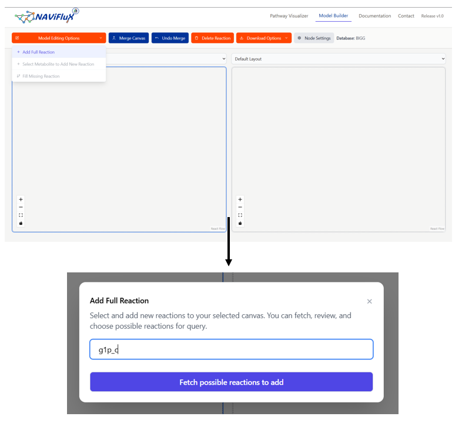
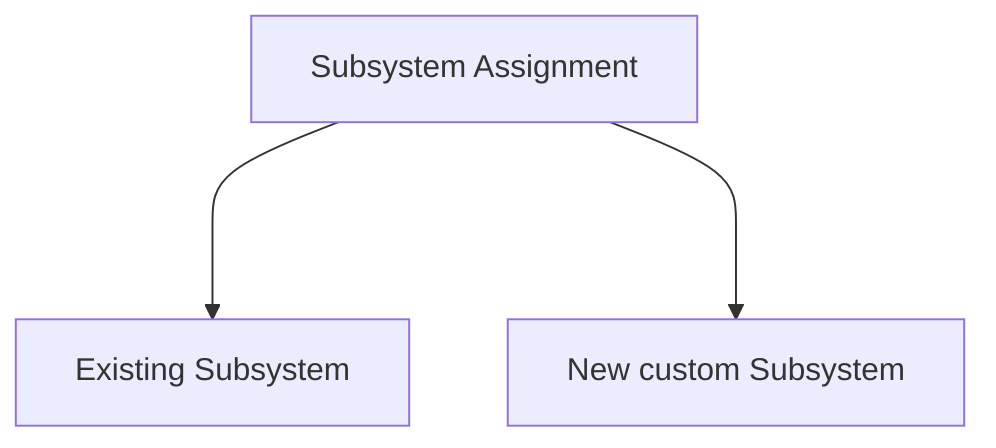

The **Add Full Reaction** is a feature that helps you add an entire reaction based on a query search

!!! note "Information"
    This feature is similar to [Add New Reaction](./add-new-reaction.md), with the only difference that this feature allows you to search a reaction by their abbreviation, name or its reaction string

--- 

### **Steps to Add Reaction**

- Click the **Add Full Reaction** button to start adding a new reaction
- In doing so, you will be prompted with a text box to search a reaction by name, abbreviation or its reaction string
- Based on the query, you will be provided a resulting table for potential reactions based on your query

### **Result Table**

Each row in the table corresponds to a potential reaction that can be added to the model. 

| **Column**       | **Description**                                                                 |
|------------------|---------------------------------------------------------------------------------|
| **Reaction**     | Identifier for the reaction (e.g., `PPC`, `ICL`) |
| **Description**  | Full name of the reaction (e.g., *Phosphoenolpyruvate carboxylase*)             |
| **Reaction string** | Stoichiometric equation showing substrates and products (e.g., `PEP + CO₂ → OAA`) |
| **Lower bound**  | Minimum allowable flux value (e.g., `0` for irreversible reactions). **Default `-1000`**             |
| **Upper bound**  | Maximum allowable flux value (e.g., `1000` for unconstrained forward flux). **Default `1000`**     |

!!! tip "Recommendation" 
    It is recommended to understand the definitions of lower bound and upper bound to effectively apply them to the potential new reactions. 

--- 

### **Assigning Subsystem**

For each row in the result table, you are required to assign a subsystem to that reaction. You are provided with the following two options

#### Existing Subsystem
If the model already contains reactions with subsystems assigned, you can potentially assign it based on the existing subsystems

#### Custom Subsystem
Alternatively, you also provided with a textbox to enter the name of a new subsystem. 

!!! note "Point to be noted"
    The custom subsystem will appear as existing subsystem when you use the **Add Full Reaction** feature again.