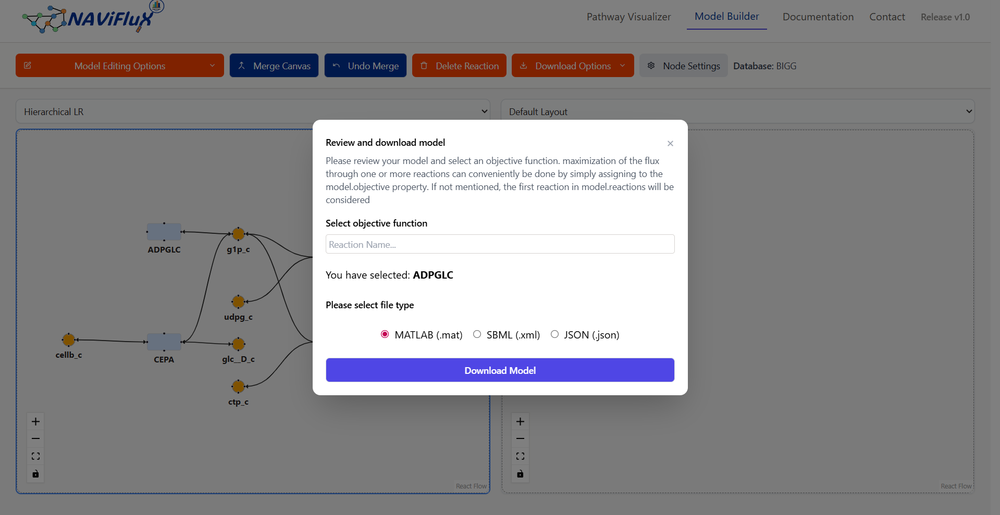

## Download COBRA Model

The **Download COBRA Model** feature allows you to export the reconstructed metabolic network into standard COBRA-compatible formats.  
These files can be re-imported into the application for further editing.  

## Available Formats

| Format   | Extension | Usage                                                                 |
|----------|-----------|----------------------------------------------------------------------|
| MATLAB   | `.mat`    | Directly compatible with the **COBRA Toolbox** in MATLAB.            |
| JSON     | `.json`   | Lightweight format, supported by **COBRApy** and other Python tools. |
| SBML     | `.xml`    | Standard exchange format for systems biology |
