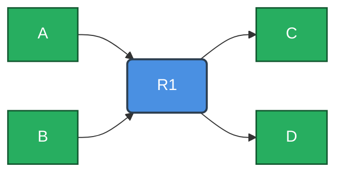
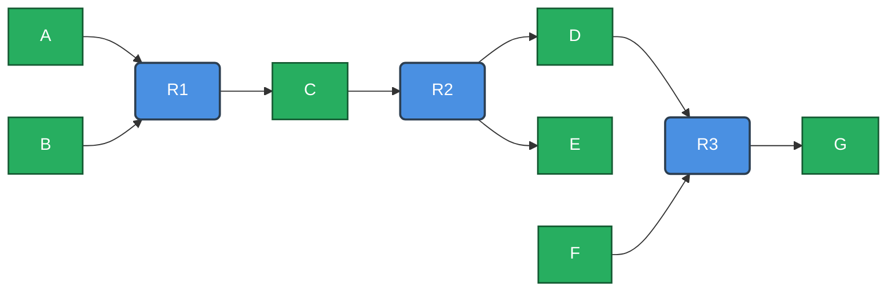

## Download Edge List

The **Download Edge List** feature allows you to export the reconstructed model as different types of edge lists: **Reaction–Metabolite**, **Metabolite–Metabolite**, or **Reaction–Reaction**.

---

#### Reaction–Metabolite

In this format, edges connect reactions to their associated metabolites.

Example:

| **Source** | **Target** | **Type**        |
| ---------- | ---------- | --------------- |
| A          | R1         | Substrate → Rxn |
| B          | R1         | Substrate → Rxn |
| R1         | C          | Rxn → Product   |
| R1         | D          | Rxn → Product   |

where

* **A, B**: Substrates
* **R1**: Reaction
* **C, D**: Products

**Note:** Directionality is preserved.

---

#### Metabolite–Metabolite

In this format, edges connect **substrates** to **products** through the reactions that consume/produce them.

Example:

| **Source** | **Target** | **Type**            |
| ---------- | ---------- | ------------------- |
| A          | C          | Substrate → Product |
| A          | D          | Substrate → Product |
| B          | C          | Substrate → Product |
| B          | D          | Substrate → Product |

where

* **A, B**: Substrates
* **C, D**: Products

**Note:** Directionality is preserved.

---

#### Reaction–Reaction

In this format, edges connect reactions via **shared metabolites**

Example:

| **Source** | **Target** | **Shared Metabolite(s)** |
| ---------- | ---------- | ------------------------ |
| R1         | R2         | C                        |
| R2         | R3         | D                        |

where

* **R1** produces **C**
* **R2** consumes **C**
* **R2** produces **D**
* **R3** consumes **D**

