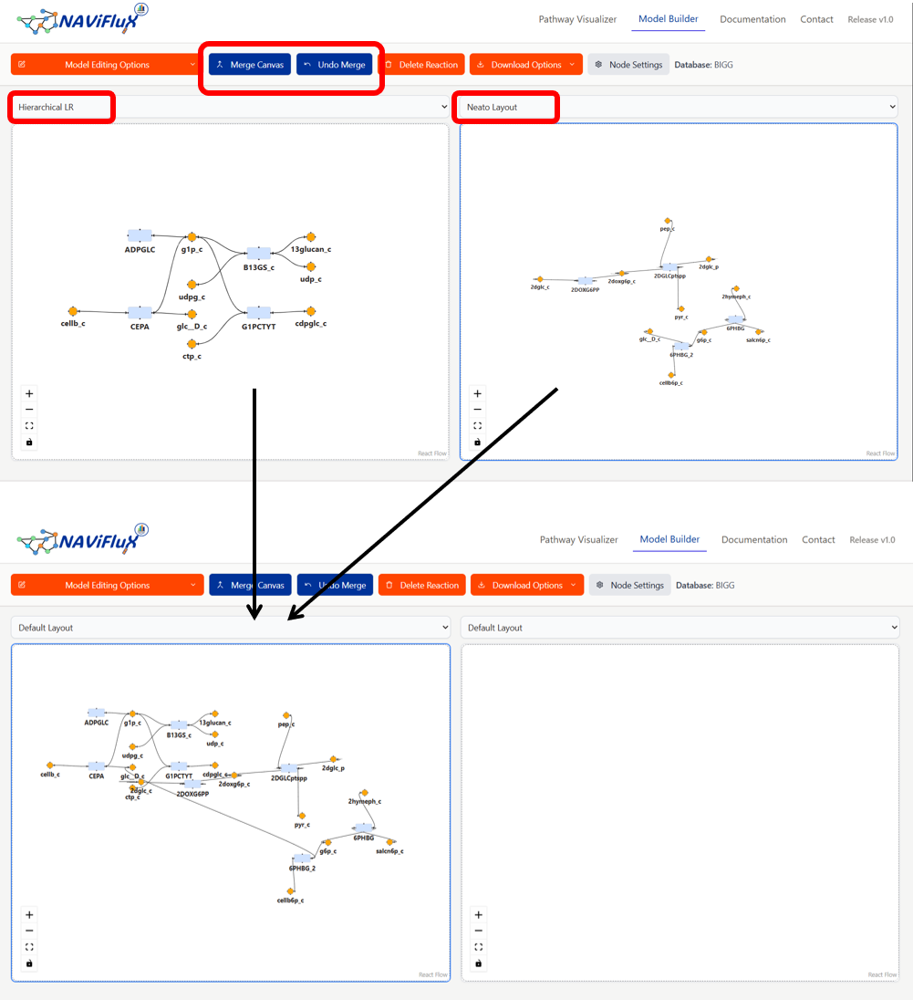

The **Merge Canvas** feature allows you to merge both the canvases together if necessary. 

### **Step to merge canvases**
- Click the **Merge Canvas** button to start merging. 
- Next, you are prompted to select two canvases in order. **The selection is indicated by a green outline around the canvas**
- Once both the canvases are selected, click the same merge button (Now named **Merge selected Canvas**) to complete merging

!!! tip "Preservation of layouts"
    Each canvas is associated with a certain layout/orientation. Once the merge has been completed, the layout positions will be retained in the merged canvas. 

### **Undo Merge** 

The Undo Merge feature will help you revert back to the original two canvases before merging