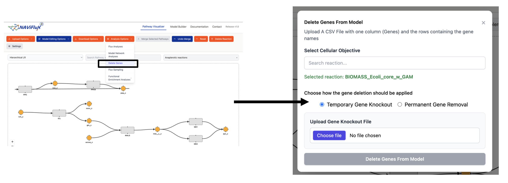

## **Delete Genes**

The **Delete Genes** feature allows you to simulate the effect of removing one or more genes from a metabolic model. Unlike **Single-Gene Deletion** (which iterates over each gene individually), this feature lets you **delete a custom set of genes simultaneously**, enabling multi-gene knockout studies and evaluation of combinatorial gene essentiality.

---

## **Workflow**



1. Select the **"Delete Genes"** option under the **Analysis Options** dropdown.
2. Choose the **cellular objective** function.
3. Upload a **CSV file** containing the gene names to be deleted.
4. Select the knockout mode — **Temporary** or **Permanent**.
5. Review the results: objective function value, number of blocked reactions, and affected pathways.

---

## **Input**

### Cellular Objective

Select a **cellular objective function** (e.g., Biomass reaction) that the model will optimize after the gene deletion.

### Gene List (CSV)

Upload a **CSV file** with a single column named **`Genes`** containing the gene identifiers to be deleted.

**Format:**

```
Genes
gene_1
gene_2
gene_3
```

!!! tip "Preparing the gene list"
    The gene list can be prepared in two ways:

    - **Custom selection** — manually curate genes of interest based on experimental evidence, literature, or hypothesis-driven analysis.
    - **MetNetComp output** — use gene deletion strategies provided by [MetNetComp](https://www.genome.jp/metnetcomp/database1/indexFiles/), a database that provides **simulation-based gene deletion strategies for growth-coupled production** in constraint-based metabolic networks. For designated target metabolites, MetNetComp computes maximal and minimal gene deletion strategies across multiple genome-scale models (e.g., *E. coli*, *S. cerevisiae*, *M. tuberculosis*). The gene deletion sets from MetNetComp can be directly used as input here to evaluate their effect on the model.

---

## **Knockout Modes**

### Temporary Gene Knockout

Deletes the selected genes from the model **temporarily** and displays the results — including the **objective function value**, the **number of blocked reactions**, and other affected metrics. Once you close the results dialog, the model **reverts back to its original state**. This is useful for exploratory analysis without permanently altering the model.

### Permanent Gene Knockout

Deletes the selected genes from the model **permanently**. The gene–protein–reaction (GPR) associations are updated, and all reactions that become non-functional due to the deletion are removed. The model is **irreversibly modified** and subsequent analyses will operate on the reduced model.

!!! warning "Permanent changes"
    Permanent Gene Knockout modifies the model in place. Make sure to download a copy of the original model before applying permanent deletions.

---

## **How it Differs from Single-Gene Deletion**

| Feature                     | Single-Gene Deletion                                  | Delete Genes                                            |
| --------------------------- | ----------------------------------------------------- | ------------------------------------------------------- |
| **Scope**                   | Deletes one gene at a time, iterating over all genes   | Deletes a user-defined set of genes simultaneously      |
| **Purpose**                 | Identify individual gene essentiality                  | Simulate multi-gene knockouts and combinatorial effects  |
| **Input**                   | No input required — runs automatically for each gene   | Requires a CSV file with target gene names              |
| **Persistence**             | Results only — model is never modified                 | Supports both temporary and permanent knockout modes     |
| **Use case**                | Genome-wide essentiality screening                     | Targeted knockout studies, pathogen-specific gene removal|
