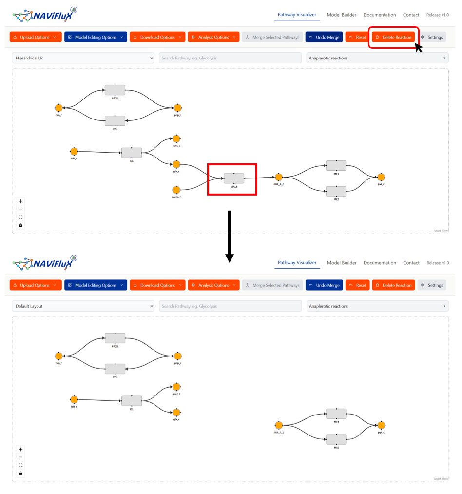
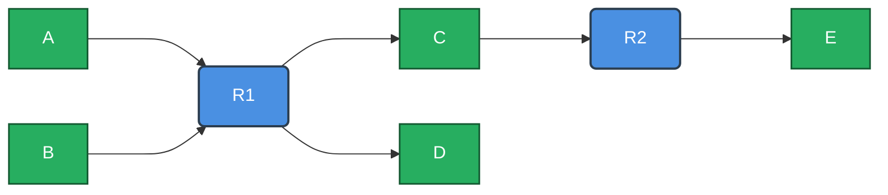
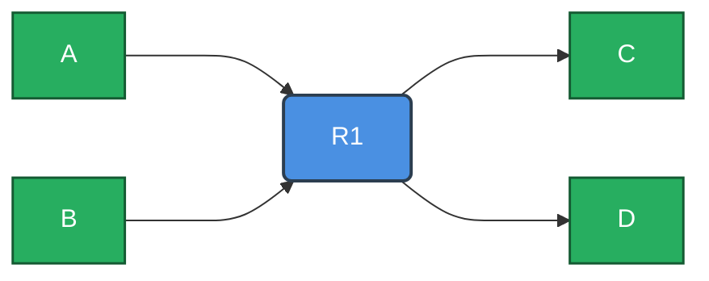

---
hide:
  toc: true             # hides the right sidebar
---

The **Delete Reaction feature** enables you to completely remove specific reactions of your choice from the model.

!!! tip
    If you wish to undo all deletions, check out [Reset Button](./reset-button.md)

### **How Delete Reaction works**

!!! tip "Recommendation"
    It is highly advised to understand the difference between metabolite and reaction nodes. [Notations Documentation](./../pathway-visualizer/notations.md)

#### Before Deletion

Consider a custom model, where a metabolite is part of two reactions. The aim is to demonstrate the **Delete Reaction** feature. Lets say you want to **delete Reaction - R2**

Since **metabolite C** is part of both R1 and R2, deleting the reaction R2 will not delete metabolite C. Instead it only deletes nodes R2 and E.

#### After Deletion

