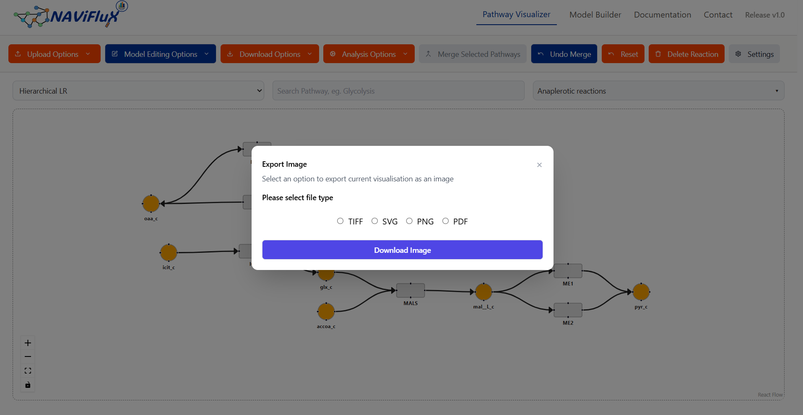

## Download Images

The **Download Images** feature allows you to export the current netwok as an image in the following formats. 

!!! important "Important"
    This option only exports the **nodes and edges currently visible in the viewport**.  It does not export the full model.

!!! tip "Recommendation"
    To export the **entire model**, we recommend selecting all pathways in the dropdown, applying any changes, and then downloading the tool file.

## Available Formats

| Format   | Extension | Usage                                                              |
| -------- | --------- | ------------------------------------------------------------------ |
| **TIFF** | `.tiff`   | High-quality images, lossless storage, large file sizes.           |
| **PNG**  | `.png`    | Lightweight, lossless compression, web and app friendly.           |
| **SVG**  | `.svg`    | Scalable vector graphics, easily editable, resolution-independent. |
| **PDF**  | `.pdf`    | Portable, print-ready documents, widely supported.                 |

