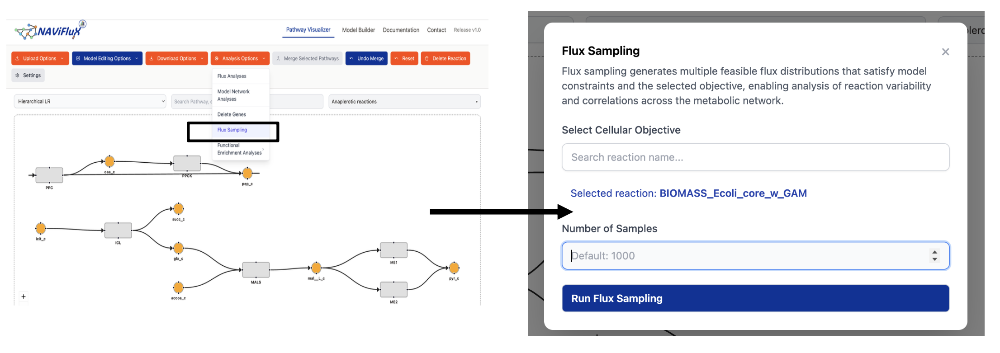

## **Flux Sampling**

Flux Sampling generates a **representative set of feasible flux distributions** across the solution space of a metabolic model. While FBA returns a single optimal solution, flux sampling explores the **entire range of possible steady-state flux values**, providing a statistically rich view of metabolic capabilities.

!!! info "Why is Flux Sampling useful"
    Standard FBA and pFBA return a single flux distribution, which may not capture the full biological picture. Many different flux distributions can satisfy the same constraints, and the cell may not always operate at the mathematical optimum. Flux sampling addresses this by generating thousands of feasible solutions, enabling analysis of **flux distributions**, **pathway usage frequencies**, and **metabolic flexibility** without assuming a single objective.

---

## **Workflow**

1. Select the **"Flux Sampling"** option under the **Analysis Options** dropdown.
2. Choose the **cellular objective** function.
3. Set the **number of samples** (default: 1000).
4. Run the analysis — results will be downloaded automatically.

---

## **Input**

### Cellular Objective

Select a **cellular objective function** (e.g., Biomass reaction) that defines the optimization target for constraining the solution space.

### Number of Samples

Specify the number of flux distributions to generate.

| Parameter            | Description                                      | Default |
| -------------------- | ------------------------------------------------ | ------- |
| **Number of Samples** | Total flux distributions to be sampled           | `1000`  |

!!! tip "Choosing the number of samples"
    A higher number of samples provides better statistical coverage of the solution space but increases computation time. The default of **1000** is sufficient for most analyses. For high-dimensional models or when precise distribution estimates are needed, consider increasing to **5000–10000**.

---

## **How Flux Sampling Works**

Flux sampling uses **Monte Carlo-based methods** (such as optGpSampler or ACHR — Artificially Centered Hit-and-Run) to draw random points from the feasible solution space defined by:

$$
\begin{aligned}
S \cdot v &= 0 \quad \text{(steady-state mass balance)} \\
v_{\min} &\le v \le v_{\max} \quad \text{(flux bounds)}
\end{aligned}
$$

The sampler generates $N$ flux vectors $\{v^{(1)}, v^{(2)}, \dots, v^{(N)}\}$, each satisfying the above constraints. Together, these samples characterize the **shape and extent** of the feasible flux space.

From the sampled distributions, you can compute:

- **Mean flux** for each reaction — expected metabolic activity
- **Standard deviation** — variability of each reaction's flux
- **Flux histograms** — distribution shape for individual reactions
- **Correlation between reactions** — co-regulated or coupled pathways

---

## **Output**

The flux sampling results are **downloaded** as a file containing the sampled flux values for all reactions across the specified number of samples.
