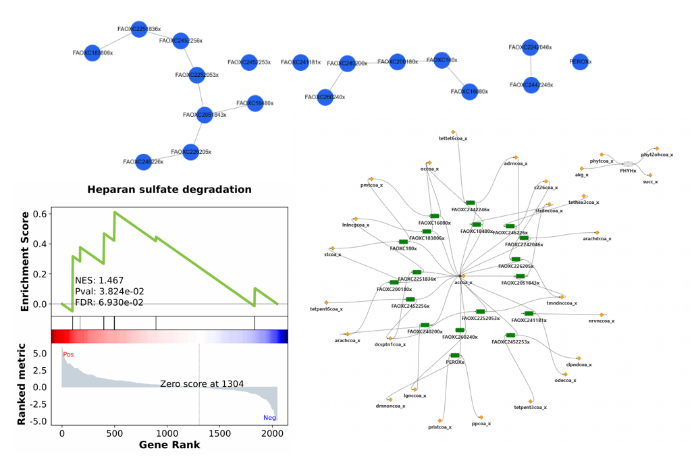

**Gene Set Enrichment Analysis (GSEA)** helps you to identify **enriched reactions and pathways** in your metabolic model using a **ranked list file** that you upload.

Analysis is done by the **[`gseapy`](https://gseapy.readthedocs.io/)** Python package (via the `gp.prerank` function).

## **Input**

You need to provide a **ranked list file** containing reaction IDs and associated scores.

**Format (comma-separated, .csv):**

```
Reaction      Rank
PMANM         5.881484159
SELCYSLY      5.667135956
SELCYSLY2     5.667135956
FBP           5.548850782
FBP26         5.548850782
PI4PLC        5.376448076
PI45PLC       5.376448076
PIPLC         5.376448076
```

* **Reaction** → identifier of a metabolic reaction in the model
* **Rank** → score indicating importance (e.g., fold change, z-score, differential expression statistic)

---

## **Parameters**


In the modal, you can configure the following analysis options:

| Parameter          | Description                                                       | Default          | Notes                                                                                                                  |
| ------------------ | ----------------------------------------------------------------- | ---------------- | ---------------------------------------------------------------------------------------------------------------------- |
| **Permutations**   | Number of random permutations to compute statistical significance | `1000`           | Higher values = more stable p-values, but slower                                                                       |
| **Min Size**       | Minimum pathway size (number of reactions) to be tested           | `15`             | Avoids very small pathways                                                                                             |
| **Max Size**       | Maximum pathway size (number of reactions) to be tested           | `500`            | Avoids overly broad pathways                                                                                           |
| **Metrics**        | Statistical measures reported                                     | —                | **FDR q-val** = False Discovery Rate <br> **FWER p-val** = Family-wise Error Rate |
| **p-value cutoff** | Significance threshold to filter enriched pathways                | `0.05` or `0.01` | Applied to FDR/FWER values                                                                                         |


---

## **Results**

After running GSEA, a **ranked table of enriched pathways** is displayed:


Each row corresponds to a significantly enriched pathway.

* Clicking on a row will:
    1. Open a **reaction–reaction network** displaying the subset of reactions responsible for the enrichment.
    2. Highlight these reactions as **green nodes** in the **main canvas**, linking enrichment back to the global network view.


| Column          | Description                                                                                                                        |
| --------------- | ---------------------------------------------------------------------------------------------------------------------------------- |
| **pathway**     | Name of the pathway (from your `gene_sets` database, e.g. KEGG, MetaCyc, or custom).                                               |
| **es**          | *Enrichment Score* → raw measure of how strongly the pathway’s reactions are skewed toward the top or bottom of the ranked list.   |
| **nes**         | *Normalized Enrichment Score* → ES adjusted for pathway size and permutation background, allowing fair comparison across pathways. |
| **fdr**         | *False Discovery Rate (q-value)* → estimated probability that a pathway identified as enriched is a false positive.                |
| **fwer**        | *Family-Wise Error Rate p-value* → conservative correction accounting for multiple hypothesis testing.                             |
| **nom**         | *Nominal p-value* → unadjusted significance of enrichment for that pathway.                                                        |
| **gene %**      | Proportion of reactions in the pathway that appear in the ranked list.                                                             |
| **tag %**       | Proportion of ranked list contributing to the enrichment score (leading-edge reactions).                                           |
| **lead\_genes** | The genes / reactions that caused the pathway to be enriched                           |




!!! tip "Important"
    Only pathways meeting the **p-value cutoff** are shown in the table.


