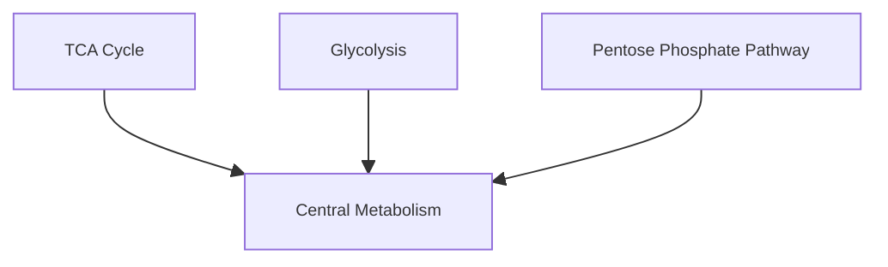

The **Merge Pathways** feature allows you to combine two or more selected pathways into a single custom named pathway.

---

### **Use Case**

If there are two or more selected pathways, you can click the **Merge Pathways** button and assign a custom name.

#### More Practical Use Cases:

* **Multi-pathway studies**: Merge *Fatty Acid Biosynthesis* and *Fatty Acid Degradation* into **Lipid Metabolism**.
* **Subsystem simplification**: Merge *Glyoxylate Cycle* and *TCA Cycle* into a broader **Energy Metabolism**.
* **Custom grouping**: Merge *Nucleotide Biosynthesis* and *Amino Acid Biosynthesis* into **Biomolecule Biosynthesis** for targeted analysis.

---

### **Undo Merge**

* The **Undo Merge** option lets you revert pathways back to their original state.

!!! warning "Warning"
    If you made **changes before merging**, they will persist after the merge.

!!! warning "Warning"
    If you make **changes after merging** and then undo, those changes will be lost — you will return to the state **at the time of merging**.

!!! tip "Recommended"
    Make the decision to merge first and then proceed with the modifications.

