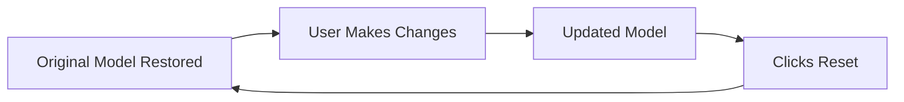

The **Reset** button restores the uploaded model to its original state. When you click **Reset**:

- All edits, added/removed reactions, subsystem reorganizations, and any other modifications are **permanently discarded**.
- The model on the server/UI is replaced with the exact model as it was right after upload.
- **There is no automatic undo** for changes made *after* the reset — those edits are lost.

!!! warning "Important"
    Use **Reset** only if you are sure you want to discard all current changes. If you want to keep a copy before resetting, export or save the model first.

