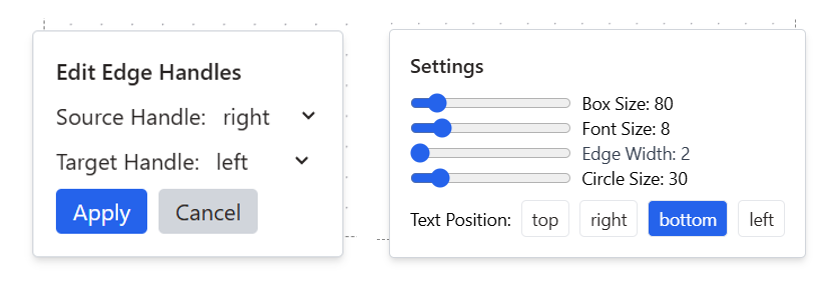

The **Settings** button provides customization options for how the nodes are displayed.

---

#### 1. **Label Representation Position**

* This option allows the user to control where labels appear relative to their nodes.
* Possible positions:
    * **Top** – labels appear above the edge connection.
    * **Bottom** – labels appear below the edge connection (**default**).
    * **Left** – labels are placed to the left side.
    * **Right** – labels are placed to the right side.

#### 2. **Label Font Size**

* This option allows the user to increase of decrease the font size of labels represented for each node.
* By default, lables have a **Font size of 8**

#### 3. **Metabolite Node Size Adjustment**

* This option allows the user to **increase or decrease the size of metabolite nodes** in the pathway.
* By default, nodes have a **standard size of 30**.
* The user can scale them up for better visibility, e.g., when presenting or focusing on certain metabolites.

#### 4. **Reaction Node Size Adjustment**

* This option allows the user to **increase or decrease the size of reaction nodes** in the pathway.
* By default, nodes have a **standard size of 80**.
* The user can scale them up for better visibility, e.g., when presenting or focusing on certain reactions.

#### 5. **Edge Thickness**

* This option allows the user to **increase or decrease the size of the edges** in the pathway.
* By default, edges have a **standard thickness of 2**.

---

#### 6. **Changing edge handles**

!!! note "To be noted"
    By default, all edges:

    * **Start** from the **right side** of the source node.
    * **End** on the **left side** of the target node.

    However, depending on the chosen layout, different edge orientations may improve clarity. This feature allows you to **reassign edge handles** while keeping the source and target unchanged.

##### **CASE 1: Selecting multiple edges**

* Click on edges one by one to select them.
* Change the **edge handle** for all selected edges at once.

##### **CASE 2: Selecting all edges**

* Hold **Ctrl** and select one edge.
* This action selects **all edges in the graph**.
* You can then apply the new edge handle orientation **simultaneously** to all edges.

