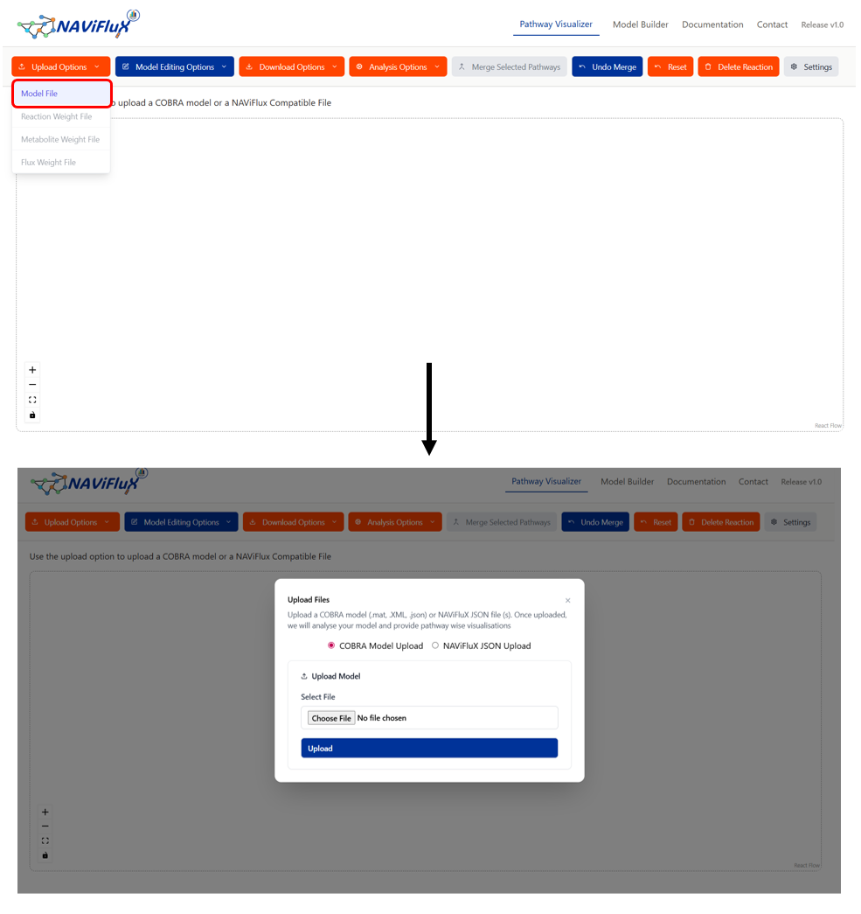

# Upload File

To get started with the App, you can use the Upload Files Dropdown to choose an option. The **Upload File** feature lets you import existing **metabolic pathway models** into the pathway visualizer. This means you can immediately begin **analyzing, editing, and exploring pathways** without rebuilding them manually.

### KEGG Models 
**Kyoto Encyclopedia of Genes and Genomes (KEGG)** is a collection of databases dealing with genomes, biological pathways, diseases, drugs, and chemical substances.

Visit [KEGG Homepage](https://www.genome.jp/kegg/)

- **Supported formats:** 

- **`.mat`**  
  *MATLAB*

- **`.xml`**  
  *SBML*

- **`.json`**  
  *JSON*

---

### BiGG Models
**BiGG Models** is a knowledgebase of genome-scale metabolic network reconstructions. Developed by the Systems Biology Research Group at the University of California, San Diego (UCSD). 

It provides curated models of many organisms such as yeast, bacteria and Humans. 

Visit [BiGG Homepage](http://bigg.ucsd.edu/)

- **Supported formats:** 

- **`.mat`**  
  *MATLAB*

- **`.xml`**  
  *SBML*

- **`.json`**  
  *JSON*

---

### MATRIX File

The **MATRX File (.json)** is specifically designed for this tool. It preserves all data, edits and pathways layouts assuring no loss in information.

!!! tip 
    Best for **re-uploading saved models**  

    