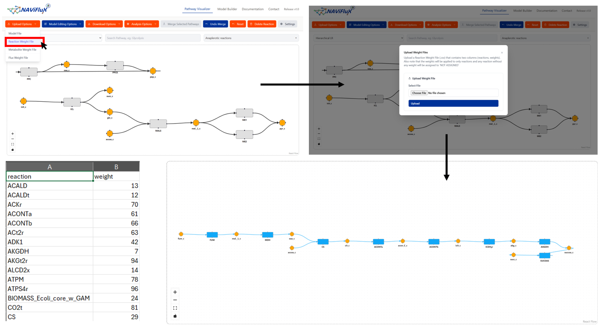

The **Upload Reaction Weight File** feature allows you to assign **custom weights** (experimental values, fluxes, scores, or any calculated metrics) to reactions in the pathway. These weights are then reflected in the **visualization** as **color gradient of reaction nodes**

### **Why use a weight file?**

* **Highlight active reactions** – Emphasize highly active reactions in a metabolic pathway.
* **Integrate external analysis** – Import weights proteomics, or transcriptomics pipelines.
* **Custom experiments** – Annotate any node with your own importance scores or calculated metrics.

